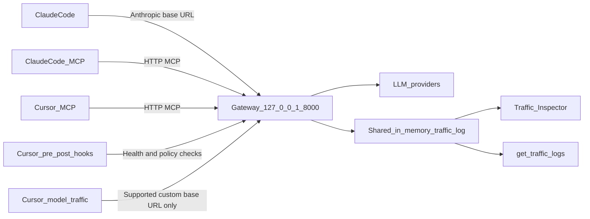

# Cross-platform client integration

## Goal

Build an MDM-compatible demo installer that configures one always-running gateway for
Claude Code and Cursor. Both clients must use the same process, MCP endpoint, traffic
ring buffer, and Traffic Inspector. No `.mdc` file will be created or modified.

The local installer demonstrates the deployment. In production, MDM distributes and
protects the generated service and client configuration.

## Resulting architecture

## 1. One shared gateway service

- Keep the service on `127.0.0.1:8000`; reject non-loopback bind settings.
- Start exactly one gateway process per machine/user deployment.
- Preserve the existing in-process `trafficLog`, `/logs`, console, and MCP
  `get_traffic_logs` integration.
- Make startup idempotent: a healthy gateway is reused, a foreign process on the port is
  rejected, and concurrent starts cannot create separate instances.
- Add a stable installation identifier to `/healthz` so the installer verifies that the
  listener is this gateway rather than an unrelated local server.
- Fail closed when startup or health verification fails; do not report success and leave
  clients pointed at a dead endpoint.

## 2. Cross-platform service adapters

Add an OS-detecting installer entry point plus native adapters:

- macOS: generate/install a user `launchd` agent for the demo; provide a system-daemon
  template suitable for MDM deployment.
- Linux: generate/install a `systemd --user` service for the demo; provide a system-unit
  template for managed deployment.
- Windows: install a user Scheduled Task for the demo; provide an elevated Windows
  Service/Task template suitable for Intune or Group Policy.

Every adapter will:

- Discover the repository and Node executable instead of hard-coding paths.
- Use one canonical host, port, log location, and configuration file.
- Support `install`, `uninstall`, `start`, `stop`, `status`, and `doctor`.
- Poll `/healthz` and return non-zero on failure.
- Avoid printing credentials, request bodies, or raw PII.
- Be repeatable without overwriting unrelated user configuration.

## 3. Claude Code integration

Generate organization-compatible Claude Code configuration outside individual projects:

- Set `ANTHROPIC_BASE_URL=http://127.0.0.1:8000`.
- Register a managed `SessionStart` hook that verifies the shared service is healthy.
- Configure the gateway MCP endpoint at `http://127.0.0.1:8000/mcp`.
- Remove the existing absolute repository path and `localhost`/port mismatch.
- Ensure the hook exits non-zero if the gateway is unavailable so sessions do not
  silently bypass or fall back.
- Keep provider credentials in the gateway service environment for managed deployment;
  clients should not receive reusable upstream credentials.

The demo installer writes user-level configuration. The production MDM package installs
the equivalent organization-managed configuration with permissions preventing normal
users from editing it.

## 4. Cursor integration without `.mdc`

Use Cursor's dedicated global configuration surfaces:

- Merge the shared HTTP MCP server into the user's managed/global `mcp.json`.
- Generate global `hooks.json` entries for:
  - `sessionStart`: verify the shared gateway.
  - `beforeMCPExecution`: fail closed when the gateway is unavailable.
  - `afterMCPExecution`: emit safe diagnostics without payload contents.
  - `preToolUse` and `postToolUse`: enforce/record tool policy where supported.
- Do not create or modify `.mdc`, `.cursorrules`, or repository rule files.
- Preserve unrelated existing MCP servers and hooks through structured JSON merging.
- Document/restart-detect when Cursor must restart to reload MCP configuration.

Cursor MCP traffic will be guaranteed through the shared gateway. Cursor model traffic
will be routed only through officially supported custom provider/base-URL configuration.
Pre/post-tool hooks cannot intercept undocumented internal model network traffic, so the
demo and diagnostics must report that distinction accurately.

## 5. Gateway hardening

Before treating the gateway as an always-on shared service:

- Protect `/api/*`, `/logs`, `/rules`, and MCP inspection with a generated local token
  and restrictive origin handling.
- Remove wildcard CORS and reject unexpected browser origins.
- Disable arbitrary `x-llm-upstream` overrides by default; permit loopback overrides only
  in explicit test mode.
- Never include credential-bearing query strings in traffic-log paths.
- Add bounded non-SSE upstream response buffering.
- Add upstream connection/read timeouts and abort work after client disconnect.
- Prevent malformed JSON from bypassing blocked-model policy.
- Bound malformed SSE buffers that never produce an event separator.
- Keep all logs and snapshots post-redaction and body-only redaction behavior unchanged.

MDM completes bypass resistance by protecting configuration, withholding upstream
credentials from clients, and blocking direct provider egress. The repository alone
cannot make a user-controlled administrator account non-bypassable.

## 6. Status and demo workflow

The `doctor` command will verify:

- Node and gateway entry point are available.
- Exactly one expected service is registered.
- `/healthz`, `/mcp`, and the Traffic Inspector respond.
- Claude Code points to the gateway and has the MCP entry.
- Cursor has the MCP entry and hooks without using `.mdc`.
- Configuration host and port match the running service.
- No secret values are printed.

Demo sequence:

1. Run the installer once from this repository.
2. Verify `status` and `doctor`.
3. Launch Claude Code from another repository and send a request containing test PII.
4. Launch Cursor and call the gateway MCP tool; where supported, send model traffic
   through the configured provider URL.
5. Open `http://127.0.0.1:8000/` and show both clients in one Traffic Inspector.
6. Call `get_traffic_logs` from Claude Code and Cursor and show the same redacted entries.
7. Stop the service and demonstrate that managed hooks fail closed.
8. Restart the service and demonstrate idempotent recovery.

## 7. Exactly three new E2E tests

Create one integration phase test file containing exactly:

1. **Happy path:** Start the real gateway and fake upstream, send Claude-shaped and
   Cursor/OpenAI-shaped requests, call MCP `get_traffic_logs`, and verify both requests
   appear redacted in the same log/Inspector state.
2. **Failure path:** Simulate invalid startup or an unavailable gateway and verify the
   hook/launcher returns non-zero, never claims readiness, and does not create a bypass or
   raw-data log.
3. **Edge case:** Invoke installation/start concurrently, verify one listener and one
   gateway identity remain, then send concurrent Claude/Cursor requests and verify a
   single combined traffic log.

Tests use ephemeral ports and local fake upstreams only. They must not contact real
providers or mutate actual user Claude/Cursor configuration.

## 8. Verification and project updates

- Run the new three-test integration phase.
- Run the complete cumulative `npm test` suite.
- Run `npm run build`.
- Check diagnostics for every changed TypeScript file.
- Confirm no runtime dependency was added.
- Confirm no raw PII, URL credentials, or provider secrets appear in snapshots or output.
- Update `CLAUDE.md`'s Project Status Ledger with the phase, three test names, and final
  suite count.
- Update developer documentation with install, uninstall, status, demo, and MDM handoff
  instructions.

## Acceptance criteria

- One installer command creates a working local demo on the current OS.
- Claude Code works from repositories other than this one.
- Cursor MCP works globally without `.mdc`.
- Claude Code and Cursor read the same MCP traffic log.
- Only one gateway/Traffic Inspector instance is used.
- Startup failure is visible and fail-closed.
- Reinstallation and concurrent startup are idempotent.
- Production artifacts are suitable for MDM packaging, while bypass resistance is
  explicitly attributed to MDM policy, protected credentials, and network enforcement.